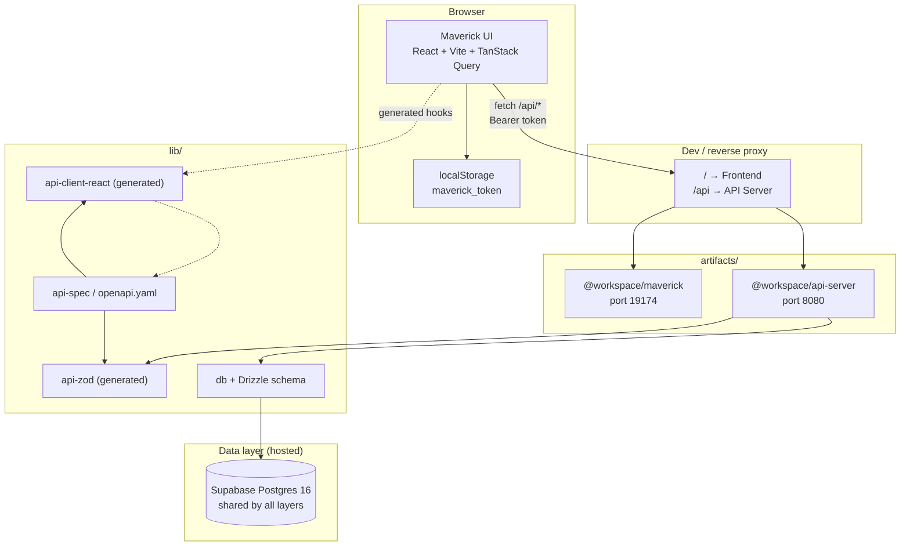
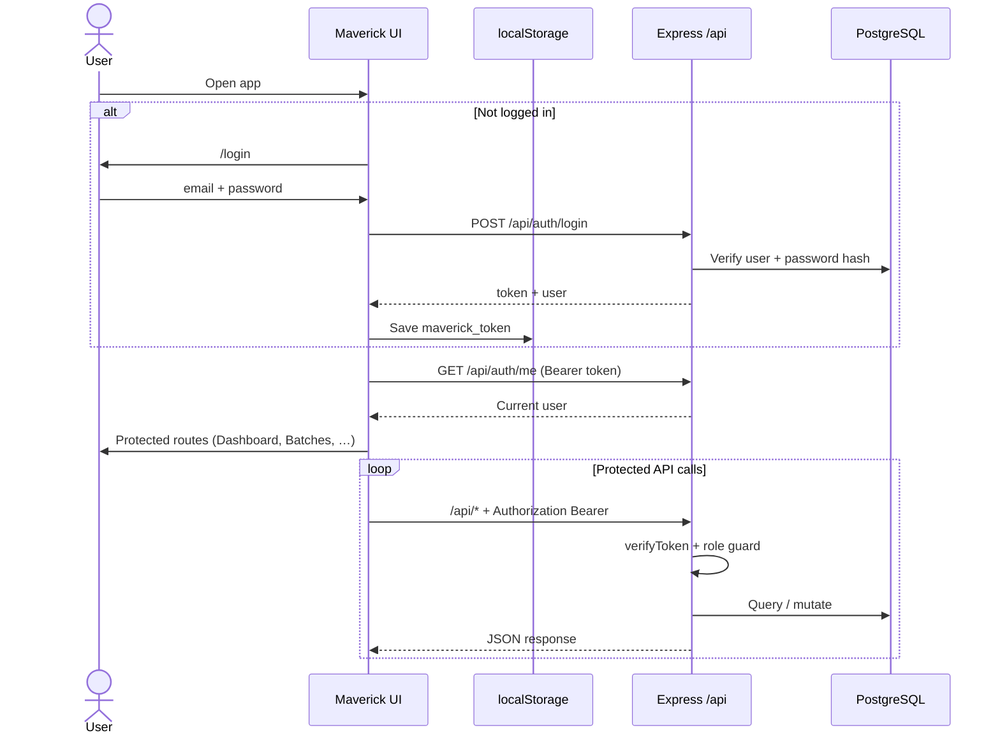
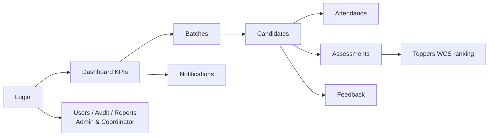

# Maverick Execution Platform

Enterprise **Training Management System (TMS)** for running training programmes end to end: batches, candidates, trainers, attendance, assessments, toppers (leaderboards), feedback, notifications, AI-narrated PDF reports, in-app walkthroughs, and audit logs. Role-based access supports **Admin**, **Coordinator**, and **Trainer** workflows.

---

## ⚡ Run it in three commands

Maverick runs as **three independent services**, one per terminal. **No local database install is required — the platform uses hosted Supabase Postgres.** You only need Node, pnpm, and Python.

| # | Layer | Port | Command (run from repo root, in its own terminal) |
|---|---|---|---|
| 1 | **Node API** | 8080 | `pnpm --filter @workspace/api-server run build && pnpm --filter @workspace/api-server run start` |
| 2 | **React Frontend** (Vite) | 5173 | `pnpm --filter @workspace/maverick run dev` |
| 3 | **Python AI Service** (FastAPI) | 9000 | `python -m uvicorn app.main:app --host 0.0.0.0 --port 9000 --app-dir services/ai` |

Open **http://localhost:5173** once all three are up. Detailed setup, env vars, and per-OS instructions live in [Run locally](#run-locally-windows--macos--linux).

> 💡 **Important — before the first run** you must populate three `.env` files (root, `services/ai/`, `artifacts/maverick/`) and `pnpm install`. See [Configuration and secrets](#configuration-and-secrets).

---

## Table of contents

- [Architecture (three layers)](#architecture-three-layers)
- [Application flow](#application-flow)
- [Key features](#key-features)
- [Autonomous Batch Monitoring Agent](#autonomous-batch-monitoring-agent)
- [Coordinator Copilot](#coordinator-copilot)
- [HTML Alert Emails, Feedback Email Polish & PDF Report Fixes](#html-alert-emails-feedback-email-polish--pdf-report-fixes)
- [Techniques used](#techniques-used)
- [Tech stack](#tech-stack)
- [Prerequisites](#prerequisites)
- [Download and install](#download-and-install)
- [Configuration and secrets](#configuration-and-secrets)
- [Run locally (Windows / macOS / Linux)](#run-locally-windows--macos--linux)
- [Default ports and routing](#default-ports-and-routing)
- [Project structure](#project-structure)
- [Product modules](#product-modules)
- [Development commands](#development-commands)
- [Troubleshooting](#troubleshooting)

---

## Architecture (three layers)

Maverick is intentionally split into **three independent runtime layers**, each in its own process. This separation makes RBAC, AI calls, and the UI deployable and scalable independently.

| # | Layer | Package | Port | What it owns |
|---|---|---|---|---|
| **1** | **Frontend** (React + Vite) | `artifacts/maverick` | **5173** | UI, role-aware navigation, Coordinator Copilot panel, walkthrough modal, calls `/api/*` |
| **2** | **Node API** (Express 5) | `artifacts/api-server` | **8080** | REST endpoints, auth, RBAC enforcement, audit log writes, proxies `/api/copilot` and `/api/ai/*` to Layer 3 |
| **3** | **Python AI Service** (FastAPI) | `services/ai` | **9000** | Azure OpenAI GPT-4.1 — Coordinator Copilot SQL+narration, AI PDF report generation, Feedback Intelligence, Trainer Scoring, Monitoring agent |

**Data:** all three layers talk to the **same hosted Supabase Postgres** via `DATABASE_URL`. There is no second database, no local Postgres install, no shared file storage.

**Important points about the three-layer split:**

- The **Frontend never talks to the AI service directly.** All AI traffic goes through the Node API, which adds the `x-internal-token` header — Azure OpenAI keys never reach the browser.
- The **Node API is the only layer that enforces user identity.** It verifies the Auth0-exchanged Base64 token, attaches `userId` + `userRole` to the request, then forwards to the AI service. Layer 3 trusts what Layer 2 tells it (defense-in-depth via shared internal secret).
- The **AI service is stateless w.r.t. user identity.** It re-reads role + batch scope from the DB using the `user_id` Node passes in. This lets Layer 3 be safely cached / scaled horizontally.
- **OpenAPI is the single source of truth** — `lib/api-spec/openapi.yaml` generates both the Zod schemas the Node API validates against and the TanStack Query hooks the React app calls.

Monorepo: **pnpm workspaces** (npm/yarn blocked). **Drizzle ORM** for typed DB access. **Orval** for codegen.



**Layer responsibilities**

| Layer | Package / path | Role |
|--------|----------------|------|
| UI | `artifacts/maverick` | Pages, layout, auth hook, charts |
| API | `artifacts/api-server` | Express 5 routes, auth middleware, enrichment |
| Contract | `lib/api-spec/openapi.yaml` | Single source of truth for REST API |
| Codegen | `lib/api-zod`, `lib/api-client-react` | Do not edit `generated/` files |
| Database | `lib/db` | Drizzle schema + SQL migrations applied directly to Supabase (no local Postgres) |

---

## Application flow

### Authentication and request flow



### High-level user journey



**Auth model:** Stateless **Base64 JSON tokens** (not JWT). The frontend stores the token in `localStorage` under `maverick_token` and sends `Authorization: Bearer <token>` on API calls. Auth0 is used for the sign-in flow; the Auth0 access token is exchanged once for the local Base64 API token via `POST /api/auth/exchange`.

**AI layer:** A separate **Python / FastAPI** service (`services/ai/`) hosts the AI features (feedback analysis, notification copy, chatbot SQL+summary, CrewAI agent runs). It calls **Azure OpenAI GPT-4.1** via `langchain-openai` and `litellm`. The Node API proxies `/api/ai/*` to the FastAPI service using a shared internal token.

---

## Key features

### Core training operations

- **Role-based dashboards** — Admin, Coordinator, and Trainer get distinct views: KPIs (total candidates, running batches, attendance %, cleared / offered / onboarded / dropped), attendance trends, candidate pipeline funnel, recent activity feed, and Monitoring agent risk summary.
- **Batch lifecycle management** — create batches, assign trainers, soft-delete (`deleted_at`), status transitions (`planned → running → completed → closed`). Status changes emit dedicated `batch_status_changed` / `batch_closed` audit rows.
- **Candidate pipeline** — profile management with status flow (`active → discontinued / cleared / offered / onboarded`). Bulk Excel import with row-by-row duplicate reporting.
- **Attendance** — daily roster marking (present / absent / leave), bulk Excel upload with duplicate detection, per-batch cutoff time for late-marking, candidate-level attendance % rollups, alerts for ≥3 consecutive absences.
- **Assessments** — sprint reviews, coding rounds, API tests, project evaluations, all weighted. Trainers can only edit assessments they created (server-enforced).
- **Toppers leaderboard** — Weighted Composite Score (WCS) ranking across Sprint, API/Coding, Project, and Attendance components. Weight sliders sum to 100 % and are admin/coordinator-only (trainers see a disabled read-only view).
- **Feedback collection** — coordinator triggers an MS Forms feedback request; responses are ingested and surfaced per batch.
- **Notifications centre** — per-user in-app alerts with read/unread state and a notification log table.
- **Users & RBAC** — Admin, Coordinator, Trainer; gated routes, gated APIs, server-enforced 403s, and trainer batch-scope on every read path.

### AI features (Azure OpenAI GPT-4.1)

- **Coordinator Copilot** — single conversational AI surface (slide-over from the header) that turns plain-English questions into safe `SELECT` queries via GPT-4.1. **Live schema introspection** so the prompt can't drift from the DB, **RAG context** from `match_rag`, **per-caller batch-scope enforcement** (admin unrestricted; coordinator → managed batches; trainer → batches via `batch_trainers`), **anti-prompt-injection clause** in the system prompt, **SSE token streaming**, table / number / bar result rendering, CSV export, 👍/👎 feedback, and per-session token + INR cost tracking. See [Coordinator Copilot](#coordinator-copilot).
- **AI-narrated PDF reports** — every report (Attendance, Assessment, Topper, Consolidated) exports to a multi-page PDF with a cover header, page numbers, GPT-4.1-written **executive summary + key insights + risks + recommendations**, and the full data table as an appendix. AI only sees the deterministic metrics dict (never raw rows), so it cannot invent data; failure falls back to a deterministic narrative and still ships the PDF. Triggered via `?format=pdf` on the existing report endpoints — CSV/Excel paths untouched.
- **Autonomous Batch Monitoring Agent** — rule-driven background agent that scans every running batch on a schedule (or on demand), evaluates 8 health rules, creates `monitoring_alerts`, and fans out plain-text emails to trainer + coordinator (admin sees the dashboard, not the emails by default). Idempotent per `(batch, candidate, kind, day)`. See [Autonomous Batch Monitoring Agent](#autonomous-batch-monitoring-agent).
- **Feedback Intelligence Engine** — GPT-4.1 extracts themes, overall sentiment, sentiment score, and prioritised recommended actions from a batch's feedback. Persists to `feedback_intelligence` (one row per batch).
- **AI Trainer Scoring Engine** — GPT-4.1 scores a trainer's effectiveness on a per-batch basis from attendance %, assessment pass rate, and feedback samples. Renders as a donut + sub-score bars + reasoning + strengths/improvements.
- **Trainer Intelligence Graph** — 3-tier SVG network at `/trainers/:id` (trainer → batches → candidates) with hover tooltips, click-to-highlight, and 4 KPI tiles.
- **AI notification copywriting** — auto-drafted notification message text via GPT-4.1.
- **CrewAI agents** — multi-agent workflows for higher-level training operations.

### Security, audit, and governance

- **Hardened RBAC for the Copilot** — word-boundary `batch_id` extraction (the old substring check would let `allowed=[1]` permit `batch_id=12`), `batches` table treated as scoped so `SELECT * FROM batches` cannot leak the full batch list, explicit *"You do not have access to this batch."* response on scope denial, and a `copilot.query.denied` audit row with `role` + `denied_batches` + `allowed_batches`.
- **Topper weightage lock for trainers** — `PATCH /api/topper-config` returns 403 for trainers; Settings page disables sliders, hides the Save button, and shows a read-only notice. Every weightage change writes a `weightage_updated` audit row with full before→after snapshot.
- **Comprehensive audit log coverage** — every write logs `{ action, entity_type, entity_id, actor_id, role, before, after, ip }` via a single `writeAudit` helper. Covered events: `batch_created/updated/deleted/closed/status_changed`, `candidate_created/updated/deleted/status_changed/bulk_uploaded`, `attendance_submitted/updated/bulk_uploaded`, `assessment_created/updated/deleted`, `feedback_request_sent`, `weightage_updated`, `clearance_rate_updated`, `report_downloaded`, `user_created/updated/deleted`, `copilot.query/help/denied/rejected/timeout/narrate`.
- **Audit log UI with filters + pagination** — `/audit` page with action-type / performed-by / date-range filters, 50 rows per page, sticky header, hover rows, clickable entity IDs that jump to the affected record.

### UI / UX

- **Role-specific in-app walkthrough** — the `?` help icon in the top nav opens a full-screen modal with a left-sidebar TOC + step-by-step main area + Previous / Next / Got it footer. Admins see Admin + Coordinator + Trainer sections; coordinators and trainers see only their own. Auto-opens on first login (tracked via `walkthrough_seen` in localStorage); the help button reopens it any time.
- **Standardised status badges** — one `StatusBadge` component with a fixed palette: green for running/cleared/offered/present, blue for planned/active, gray for completed, dark gray for closed, red for not_cleared/absent/discontinued, amber for leave. Same status string looks identical across every page.
- **Reusable empty states & skeleton loaders** — `EmptyState` (icon + title + description + optional CTA) and `TableSkeletonRows` / `ContentSkeleton` shared across pages. No raw "Loading…" text in the rewritten surfaces.
- **Polished navigation** — Sidebar active item gets a left-border accent + background tint; Header shows the user's name with the role label stacked beneath it.

### Platform infrastructure

- **Auth0 sign-in** with stateless **Base64 JSON** API tokens (exchanged at `/api/auth/exchange` — not JWT, intentionally — and stored in `localStorage` as `maverick_token`).
- **OpenAPI-first contract** — `lib/api-spec/openapi.yaml` generates the Zod schemas the Node API validates against (`@workspace/api-zod`) **and** the TanStack Query React hooks (`@workspace/api-client-react`).
- **Hosted Supabase Postgres** — single shared database. Migrations under `lib/db/migrations/*.sql` are applied with `python scripts/apply_*.py` helpers; there is no local Postgres install.

---

## Techniques used

| Area | Technique |
|------|-----------|
| Architecture | Monorepo with **pnpm workspaces**; three runtime layers (Node API · React UI · Python AI) |
| Contract-first API | **OpenAPI 3** spec is the single source of truth; **Orval** generates Zod schemas + React Query hooks |
| Validation | **Zod** schemas shared between server and client (`@workspace/api-zod`) |
| Data access | **Drizzle ORM** with typed schema, migrations via `drizzle-kit push` |
| Auth | **Auth0** SPA login → exchanged for stateless **Base64 JSON** API tokens, sent as `Bearer` |
| API patterns | **Express 5** with role guards, request-scoped Pino logging, response enrichment middleware |
| Frontend state | **TanStack Query v5** with auto-generated hooks, optimistic updates |
| UI system | **React 19 + Vite 7**, **Tailwind CSS 4**, **shadcn/ui** primitives on Radix, **Recharts** for analytics |
| Routing | `wouter` (tiny client router) with role-gated routes |
| AI integration | **Azure OpenAI GPT-4.1** via **LangChain + litellm**; **CrewAI** multi-agent runs; RAG over Supabase data |
| Service isolation | Node API ↔ FastAPI communicate via shared `x-internal-token` header (defense-in-depth) |
| Secrets | Local `.env` files in dev; **Azure Key Vault** in production (auto-overrides plain env vars) |
| Observability | **Pino** structured logs (Node); optional **Sentry** in FastAPI |
| Build | **esbuild** bundles the API; **Vite** builds the SPA to static `dist/public`; FastAPI runs under **uvicorn** |
| Deployment | Azure App Service + Container Apps + Static Web Apps (see "Azure Deployment" section), or any container host |

---

## Tech stack

| Area | Technology |
|------|------------|
| Runtime | Node.js **24**; Python **3.12** for the AI service |
| Package manager | **pnpm** workspaces (required; npm/yarn blocked); **pip** for the AI service |
| Language | TypeScript **5.9**; Python 3.12 |
| Frontend | React 19, Vite 7, Tailwind CSS 4, shadcn/ui, Recharts, wouter, Auth0 |
| API | Express 5, Pino logging |
| AI service | FastAPI, LangChain, **Azure OpenAI GPT-4.1**, CrewAI, Supabase client |
| Database | PostgreSQL **16** (Supabase), Drizzle ORM |
| Validation | Zod (`@workspace/api-zod`) |
| Client data | TanStack Query v5 (generated hooks) |
| API codegen | Orval from OpenAPI |

---

## Prerequisites

> 🚫 **You do NOT need to install PostgreSQL locally.** Maverick uses a **hosted Supabase Postgres** instance — the only thing you need is the connection string in `DATABASE_URL`. There is no local DB to set up, seed, or run alongside the app.

| Requirement | Version / notes |
|-------------|-----------------|
| **Node.js** | 20+ locally; 24 LTS in production |
| **pnpm** | 9+ — install globally: `npm install -g pnpm` (npm / yarn are blocked at the repo root) |
| **Python** | **3.12** for the AI service (Layer 3). Required because Coordinator Copilot, AI PDF reports, and Feedback Intelligence run through it. |
| **Supabase project** | Free tier is fine. Grab the connection string from Project → Settings → Database. |
| **Azure OpenAI** | A deployment of **GPT-4.1** (and optionally a text-embedding deployment) for the AI service |
| **Auth0 tenant** | SPA application (free tier is fine) for sign-in |
| **Git** | To clone the repository |

---

## Download and install

### 1. Clone the repository

```bash
git clone https://github.com/<your-org>/Maverick-Platform-training-Management-System.git
cd Maverick-Platform-training-Management-System
```

Or download a ZIP from GitHub (**Code → Download ZIP**), extract it, and open the folder in your editor.

### 2. Install dependencies

This project **must** use **pnpm** (enforced in root `package.json`):

```bash
pnpm install
```

### 3. Configure environment variables

See [Configuration and secrets](#configuration-and-secrets). At minimum you need **`DATABASE_URL`**.

### 4. Apply database migrations to Supabase (first time only)

The schema migrations live as plain SQL files under `lib/db/migrations/`. Apply them against your **Supabase** database via the bundled helper scripts (each is idempotent — re-running is safe):

```bash
python scripts/apply_copilot_migration.py
python scripts/apply_monitoring_migration.py
python scripts/apply_trainer_scores_migration.py
python scripts/apply_feedback_intelligence_migration.py
python scripts/apply_dashboard_kpis_migration.py
```

> Alternative: paste the SQL files into the Supabase SQL editor in numeric order (`0001_*.sql` → `0007_*.sql`).

### 5. Start the application

You need **three processes** to run the full platform locally — see the [⚡ Run it in three commands](#-run-it-in-three-commands) table at the top, or [Run locally](#run-locally-windows--macos--linux) for per-OS details.

> The AI service (Layer 3) is required for Coordinator Copilot, AI PDF reports, Feedback Intelligence, Trainer Scoring, and Monitoring AI summaries. The rest of the UI works without it but those features show fallbacks.

---

## Configuration and secrets

The Node API needs the **Supabase `DATABASE_URL`** + the shared internal token, the frontend needs Auth0 credentials, and the Python AI service needs **Azure OpenAI** + Supabase credentials. Everything else is optional.

> 🔐 **All three layers connect to the same hosted Supabase Postgres.** `DATABASE_URL` looks like `postgresql://postgres.<project-ref>:<password>@aws-0-<region>.pooler.supabase.com:6543/postgres?pgbouncer=true` — copy it from Supabase → Project Settings → Database → Connection string. **Do not** install a local Postgres.

### What to configure

**Root `.env` (Node API + db + scripts)**

| Variable | Required | Used by | Description |
|----------|----------|---------|-------------|
| **`DATABASE_URL`** | **Yes** | `lib/db`, Drizzle, migration scripts | **Supabase Postgres** connection string |
| **`PORT`** | **Yes** | API server | API listen port (default `8080`) |
| **`INTERNAL_SHARED_SECRET`** (alias **`AI_INTERNAL_TOKEN`**) | **Yes** | Node ↔ AI service | Shared header `x-internal-token`. Must match the value in `services/ai/.env`. |
| `SUPABASE_URL` / `SUPABASE_SERVICE_KEY` / `SUPABASE_ANON_KEY` | Optional | Server-side admin ops | Used when Node calls Supabase REST APIs directly |
| `AI_SERVICE_URL` | Optional | Node Copilot/AI proxies | Defaults to `http://localhost:9000` |
| `ENABLE_MONITORING_SCHEDULER` | Optional | Monitoring agent | Set `true` to boot the cron loop at startup |
| `SMTP_*` | Optional | Monitoring agent email fan-out | If unset, emails go to the console transport |
| `NODE_ENV` | Optional | API | `development` or `production` |
| `LOG_LEVEL` | Optional | API logger | Default `info` |

**`artifacts/maverick/.env` (frontend / Auth0)**

| Variable | Required | Description |
|----------|----------|-------------|
| `VITE_AUTH0_DOMAIN` | **Yes** | Auth0 tenant domain |
| `VITE_AUTH0_CLIENT_ID` | **Yes** | Auth0 SPA client id |
| `VITE_AUTH0_AUDIENCE` | **Yes** | Auth0 API audience |

**`services/ai/.env` (Python AI service)**

| Variable | Required | Description |
|----------|----------|-------------|
| **`AZURE_OPENAI_ENDPOINT`** | **Yes** | e.g. `https://<resource>.openai.azure.com/` |
| **`AZURE_OPENAI_API_KEY`** | **Yes** | Azure OpenAI key |
| **`AZURE_OPENAI_DEPLOYMENT`** | **Yes** | GPT-4.1 deployment name (default `gpt-4.1`) |
| **`AZURE_OPENAI_API_VERSION`** | **Yes** | e.g. `2024-12-01-preview` |
| `AZURE_OPENAI_EMBEDDING_DEPLOYMENT` | Optional | Embedding deployment for chatbot RAG (default `text-embedding-ada-002`) |
| `SUPABASE_URL` / `SUPABASE_SERVICE_KEY` | **Yes** | The AI service reads/writes via the Supabase Python client |
| `INTERNAL_SHARED_SECRET` | **Yes** | Shared header (`x-internal-token`) between Node API and AI service |
| `NODE_API_URL` | Optional | Default `http://localhost:8080` |
| `KEY_VAULT_URL` | Optional | If set, Azure Key Vault overrides plain env vars in prod |
| `SENTRY_DSN` | Optional | FastAPI Sentry instrumentation |

### Where to add configuration

#### Local development

Create **three `.env` files** (none committed to git). Use a real Supabase connection string — there is no local Postgres to run against.

**1. Root `.env` (Node API + migration scripts)** — same folder as `package.json`:

```env
# Hosted Supabase Postgres — copy from Supabase → Settings → Database
DATABASE_URL=postgresql://postgres.<project-ref>:<password>@aws-0-<region>.pooler.supabase.com:6543/postgres?pgbouncer=true

# Supabase REST/admin keys (Settings → API)
SUPABASE_URL=https://<project-ref>.supabase.co
SUPABASE_SERVICE_KEY=<service-role-key>
SUPABASE_ANON_KEY=<anon-key>

# API server
PORT=8080
NODE_ENV=development

# Shared internal token between Node API ↔ Python AI service.
# Must match services/ai/.env value.
INTERNAL_SHARED_SECRET=change-me-to-a-long-random-string
AI_INTERNAL_TOKEN=change-me-to-a-long-random-string
```

**2. `services/ai/.env` (Python AI service)**:

```env
DATABASE_URL=<same Supabase URL as root .env>
SUPABASE_URL=<same as root>
SUPABASE_SERVICE_KEY=<same as root>

AZURE_OPENAI_ENDPOINT=https://<resource>.openai.azure.com/
AZURE_OPENAI_API_KEY=<your key>
AZURE_OPENAI_DEPLOYMENT=gpt-4.1
AZURE_OPENAI_API_VERSION=2024-12-01-preview
AZURE_OPENAI_EMBEDDING_DEPLOYMENT=text-embedding-ada-002

INTERNAL_SHARED_SECRET=<MUST match root .env value>
```

**3. `artifacts/maverick/.env` (Frontend / Auth0)**:

```env
VITE_AUTH0_DOMAIN=<your-tenant>.us.auth0.com
VITE_AUTH0_CLIENT_ID=<spa client id>
VITE_AUTH0_AUDIENCE=<api audience>
```

> ⚠️ **Important:** `INTERNAL_SHARED_SECRET` in the root `.env` and in `services/ai/.env` must be **identical** — it's the shared secret the Node API uses to authenticate to the AI service. Mismatched values give you 401s on every Copilot / PDF / Feedback Intelligence call.

> ⚠️ Never commit real passwords to git. The `.gitignore` already excludes `.env` files.

---

## Run locally (Windows / macOS / Linux)

> ✅ **Verified working** on Windows 10 + PowerShell 5.1, Node 24, Python 3.12 against Supabase Postgres + Azure OpenAI GPT-4.1.

The platform runs as **three independent processes** (the three layers). Open one terminal per service from the repo root.

### ⚠️ Important steps before running

1. **Run `pnpm install` once** at the repo root.
2. **Create the three `.env` files** with real values — root, `services/ai/`, and `artifacts/maverick/`. See [Configuration and secrets](#configuration-and-secrets).
3. **Apply Supabase migrations once** — `python scripts/apply_*.py` for each migration helper. There is no local DB to set up.
4. **First-time AI service setup** — create the Python venv and install `requirements.txt` (see Terminal 3 below). Subsequent runs skip this.
5. **`INTERNAL_SHARED_SECRET` must match** between root `.env` and `services/ai/.env`, otherwise the Copilot / PDF / Feedback Intelligence calls return 401.

### Three layers, three commands (quick reference)

Same as the table at the top of this README, kept here for jump-back convenience.

| # | Layer | Port | Command (run from repo root, one per terminal) |
|---|-------|------|------------------------------------------------|
| 1 | **Node API** (`@workspace/api-server`) | **8080** | `pnpm --filter @workspace/api-server run build && pnpm --filter @workspace/api-server run start` |
| 2 | **React Frontend** (Vite) | **5173** | `pnpm --filter @workspace/maverick run dev` |
| 3 | **Python AI Service** (FastAPI) | **9000** | `python -m uvicorn app.main:app --host 0.0.0.0 --port 9000 --app-dir services/ai` |

> **Windows PowerShell tip:** the bundled `pnpm --filter @workspace/api-server run dev` uses Unix `export` syntax and fails on PowerShell. Use the `build && start` form above instead. PowerShell does not support `&&` (it's PSv5.1) — replace it with `;` on Windows: `pnpm --filter @workspace/api-server run build; pnpm --filter @workspace/api-server run start`.

Health checks (after each service is up):

```powershell
Invoke-WebRequest http://localhost:8080/api/healthz   # {"status":"ok"}
Invoke-WebRequest http://localhost:5173/              # Vite HTML (200)
Invoke-WebRequest http://localhost:9000/healthz       # {"ok":true,"env":"development"}
```

Open the app at **http://localhost:5173**.

---

### Terminal 1 — Node API server (port 8080)

Reads `.env` via `dotenv` at boot, so no manual env loading needed. The packaged `dev` script uses Unix `export` (works on macOS / Linux / Git Bash); on Windows PowerShell run `build` + `start` directly:

```powershell
# Windows PowerShell — from repo root
pnpm --filter @workspace/api-server run build
pnpm --filter @workspace/api-server run start
```

```bash
# macOS / Linux / Git Bash
pnpm --filter @workspace/api-server run dev
```

### Terminal 2 — React frontend (port 5173)

```bash
pnpm --filter @workspace/maverick run dev
```

The Vite dev server proxies `/api` → `http://localhost:8080` (configured in `artifacts/maverick/vite.config.ts`). Open **http://localhost:5173**.

### Terminal 3 — Python AI service (port 9000, Azure OpenAI GPT-4.1)

The chatbot, feedback analysis, notification copy, and CrewAI agent runs live in a FastAPI service in `services/ai/`.

```powershell
# First-time setup only
cd services/ai
python -m venv .venv
.\.venv\Scripts\python.exe -m pip install -r requirements.txt
cd ..\..

# Make sure services/ai/.env has AZURE_OPENAI_*, SUPABASE_*, INTERNAL_SHARED_SECRET

# Run (from repo root)
& services/ai/.venv/Scripts/python.exe -m uvicorn app.main:app --host 0.0.0.0 --port 9000 --app-dir services/ai
```

macOS / Linux equivalent:

```bash
cd services/ai
python3 -m venv .venv && source .venv/bin/activate
pip install -r requirements.txt
uvicorn app.main:app --host 0.0.0.0 --port 9000
```

Health check: `GET http://localhost:9000/healthz`. Interactive docs at `http://localhost:9000/docs`. All `/ai/*` routes require the `x-internal-token` header that matches `INTERNAL_SHARED_SECRET`.

### API proxy for local dev

The frontend expects the API at **`/api`**. The Vite dev server (`artifacts/maverick/vite.config.ts`) proxies `/api` → `http://127.0.0.1:8080`. In production, your reverse proxy or static-host rewrite (e.g. Vercel `vercel.json`, Azure Static Web Apps `staticwebapp.config.json`) should do the same.

### First-time database (Supabase)

Apply the SQL migrations to your Supabase database (idempotent — safe to re-run):

```bash
python scripts/apply_copilot_migration.py
python scripts/apply_monitoring_migration.py
python scripts/apply_trainer_scores_migration.py
python scripts/apply_feedback_intelligence_migration.py
python scripts/apply_dashboard_kpis_migration.py
```

> Alternative: open `lib/db/migrations/*.sql` and paste each file into the Supabase SQL editor in numeric order.

Create users through the **Users** admin UI after logging in with an admin account. The Auth0 token exchange (`/api/auth/exchange`) upserts the user on first sign-in; you can then promote yourself to `admin` directly in Supabase or seed an initial admin row in the `users` table.

---

## Default ports and routing

| Service | Local port | Path |
|---------|------------|------|
| API Server | **8080** | `/api` |
| Maverick UI (Vite dev) | **5173** | `/` |
| Python AI service | **9000** | `/ai/*`, `/copilot/*`, `/trainer-scoring/*`, `/feedback-intelligence/*` |
| Mockup sandbox (optional) | **8081** | `/__mockup` |

**Routing (local development)**

- `/api/*` → Express API (`artifacts/api-server`) — Vite dev server proxies this to `127.0.0.1:8080`
- `/*` → Vite dev server (`artifacts/maverick`)

Health check (production): `GET /api/healthz`

---

## Project structure

```
Maverick-Platform-training-Management-System/
├── artifacts/
│   ├── api-server/            # Express API (@workspace/api-server)
│   │   └── src/routes/        # auth, batches, candidates, attendance, …
│   ├── maverick/              # Main React app (@workspace/maverick)
│   │   └── src/pages/         # Dashboard, Batches, Candidates, …
│   └── mockup-sandbox/        # UI mockups (optional, /__mockup)
├── lib/
│   ├── api-spec/openapi.yaml  # API contract — edit this, then codegen
│   ├── api-zod/               # Generated Zod schemas
│   ├── api-client-react/      # Generated React Query hooks
│   └── db/src/schema/         # Drizzle tables (users, batches, …)
├── package.json               # Root scripts (typecheck, build)
├── pnpm-workspace.yaml
```

---

## Coordinator Copilot

The single conversational AI surface in Maverick. There is **one** UI — a 420 px slide-over from the right edge (full-width on mobile) — and **two triggers** that open it:

- The **Copilot** button in the top header (visible on every page).
- The **Coordinator Copilot** entry in the left sidebar.

There is intentionally no dedicated `/copilot` page. The previous full-page route was removed because two surfaces for the same feature duplicated state and confused users about where to start; the slide-over keeps the user's current page context visible while they ask.

The Copilot answers two kinds of questions:

- **Data mode** — *"how many candidates are running this month?"*, *"top 5 candidates by assessment score"*. Generates a safe `SELECT` against Supabase and renders the result as a single number, a Recharts bar chart, or a table.
- **Help mode** — *"how do I create a new batch?"*, *"where do I mark attendance?"*. Returns a numbered list of steps and a **"Take me there →"** button that uses `wouter` to navigate to the right page in the platform. No SQL is run.

This feature **replaces the old AI Chatbot page**. The legacy `/api/ai/chatbot/query` endpoint now returns HTTP 410 with a migration hint; the RAG helper that the chatbot used has been ported into the Copilot so nothing was lost.

**How it works**

```
User question
   ↓
React CopilotPanel  →  POST /api/copilot/query  (Express, port 8080)
                          ↓  forwards with x-internal-token + req.userId
                      POST /copilot/query        (FastAPI, port 9000)
                          ↓
            1) Schema card is built from information_schema (cached for the
               process lifetime — no more drift between the prompt and DB).
            2) Platform guide is appended — every route + how to perform
               common tasks, so the model can answer "how do I X" questions.
            3) RAG: top-5 embedding chunks pulled from Supabase `match_rag`
               and prepended for grounding (best-effort).
            4) Batch-scope hint: caller's allowed batch_ids are resolved
               (admin → unrestricted; coordinator → batches they own;
               trainer → batches via batch_trainers; unknown → empty deny).
            5) GPT-4.1 plans → {mode: "data"|"help", ...}.
            6a) DATA: sql_validator.py blocks non-whitelisted SELECTs,
                _enforce_scope_in_sql() requires a batch_id from the
                allow-list when scoped tables are touched, psycopg2 runs
                the SQL with SET LOCAL statement_timeout = 5000, then
                GPT-4.1 narrates the rows token-by-token via SSE.
            6b) HELP: no SQL is run. The server returns steps + an
                allow-listed navigate_to route. The UI renders a Help card
                with a "Take me there →" button.
            7) audit_logs + copilot_usage rows written (no SQL in audit
               details — it would leak into Recent Activity).
                          ↓
             SSE: event: meta → event: token (×N) → event: done
                          ↓
             Panel renders chart_type / mode:
               "help"   → ordered list of steps + "Take me there" button
               "number" → big centered figure
               "table"  → HTML table (first 50 rows, with CSV export ≥ 10 rows)
               "bar"    → Recharts BarChart
             Per-bubble extras: 👍/👎 feedback, clickable follow-up chips.
             Header: Clear chat (trash icon).
             SQL and token-cost are intentionally hidden from end users
             (still tracked server-side for admin via /usage-stats).
```

**Endpoints**

| Method | Path | Description |
|--------|------|-------------|
| POST | `/api/copilot/query` | NL → SQL → execute → stream narrative (SSE) |
| POST | `/api/copilot/narrate` | 150-word executive summary for one batch |
| POST | `/api/copilot/feedback` | Thumbs-up/down logger (writes `copilot_usage.helpful`) |
| GET  | `/api/copilot/usage-stats` | Today's tokens, INR cost, top 5 queries (admin only) |

**Safety — three layers**

1. **Static validator** (`services/ai/app/utils/sql_validator.py`):
   - Must start with `SELECT`.
   - Blocks `DROP / DELETE / UPDATE / INSERT / TRUNCATE / ALTER / CREATE / EXEC / EXECUTE` as whole-word matches (so `updated_at` is fine).
   - Rejects any `FROM` / `JOIN` target outside `{batches, candidates, attendance, assessments, feedback, audit_logs, users}`.
   - Rejects multi-statement input.
2. **Per-caller batch scope** (`_resolve_batch_scope` + `_enforce_scope_in_sql`):
   - Admin → no restriction.
   - Coordinator → batches where `coordinator_id = user_id`.
   - Trainer → batches via `batch_trainers.trainer_id = user_id`.
   - Unknown / no-batches → any SQL touching `attendance / candidates / assessments / feedback` is refused with `"caller has no batch access"`.
3. **Postgres `SET LOCAL statement_timeout = 5000`** caps execution at 5 s.

**Schema introspection** — the column list in the planning prompt is built at first use by querying `information_schema.columns` for the whitelisted tables. Hand-curated **business rules** (enum values, naming gotchas, attendance-percent formula, date-filter idioms) live alongside in `BUSINESS_RULES` because the DB can't describe those. This kills the class of bug where the prompt and the live schema drift apart.

**Platform-aware help mode** — when the model classifies a question as a how-to / navigation question (e.g. *"How do I create a new batch?"*), it returns a JSON shape with `mode: "help"`, an ordered `steps` array, and a `navigate_to` URL (allow-listed client-side against the real route table — see `HelpCard` in `CopilotPanel.tsx`). The panel renders a "Take me there →" button that uses `wouter` to jump to the right page and closes the slide-over so the user lands unobstructed. Audit rows are written as `copilot.help` (no SQL involved) for the dedicated `/audit` admin page.

**Activity feed hygiene** — `audit_logs` records every Copilot interaction, but the Dashboard's **Recent Activity** card filters them out (`entityType !== 'copilot'`). That card is for *real* coordinator work — creating batches, marking attendance, importing candidates — and "asked a question" is noise there. The full Copilot trail is still visible to admins on `/audit`.

**RAG context** — when Supabase has a `match_rag` RPC available, the user's question is embedded with the same Azure embedding deployment used by the legacy chatbot, the top 5 matching chunks are pulled, and the joined text is prepended to the system prompt for grounding. Failure is silent — RAG is best-effort, never blocks the request.

**Data tables**

- `copilot_usage` — per-call ledger (query text, generated SQL, row count, prompt / completion / total tokens, estimated INR cost, helpful flag). Migration: [`lib/db/migrations/0002_copilot_usage.sql`](lib/db/migrations/0002_copilot_usage.sql), applied with `python scripts/apply_copilot_migration.py`.
- `audit_logs` — every Copilot call writes `action='copilot.query'` (or `.rejected` / `.timeout` / `.narrate`) with the query, SQL, row count, and user id in the details JSON.

**Cost model** — `total_tokens / 1000 × 0.166` INR (GPT-4.1 at ≈ $0.002 per 1 K tokens × 83 INR/USD). The panel footer shows running `Session: X tokens · ₹Y.YY`. The admin-only `usage-stats` endpoint surfaces today's totals and top 5 queries.

**Suggested starter queries** (shown as chips when the conversation is empty):

1. "Which batches have attendance below 80% this week?"
2. "Who are the top 5 candidates in the current batch?"
3. "Generate a summary for this batch"
4. "Show attendance trends for the past month"

**Tests** — `pytest services/ai/tests` runs 8 tests: 6 SQL-validator unit tests + 2 router auth-gate tests. All pass.

**Files**

| Path | Role |
|------|------|
| `services/ai/app/utils/sql_validator.py` | Safety validator (whitelist + keyword block) |
| `services/ai/app/routers/copilot.py` | FastAPI router (`/copilot/*`) — schema introspection, RAG, batch-scope, SSE |
| `services/ai/tests/test_sql_validator.py` | Validator unit tests |
| `services/ai/tests/test_copilot_router.py` | Router 401 tests |
| `lib/db/migrations/0002_copilot_usage.sql` | `copilot_usage` table |
| `scripts/apply_copilot_migration.py` | One-shot migration runner |
| `artifacts/api-server/src/routes/copilot.ts` | Node proxy (SSE pipe + admin RBAC) |
| `artifacts/maverick/src/components/CopilotPanel.tsx` | React slide-over panel |
| `artifacts/maverick/src/components/layout/Header.tsx` | Hosts the **Copilot** button |

---

## Autonomous Batch Monitoring Agent

A rule-driven agent that scans every running batch on a schedule (or on demand), creates `monitoring_alerts` rows when health metrics breach thresholds, and fans out emails to the trainer + coordinator. Per spec, **admins see everything in the dashboard but are NOT emailed by default**. Coordinators can trigger an on-demand scan; admins additionally control thresholds and the email log.

**Routes**

| Method | Path | Roles | Description |
|--------|------|-------|-------------|
| POST | `/api/monitoring/run` | admin, coordinator | Trigger an on-demand scan. Inserts an `agent_runs` row, runs the 8 rules across all `running` batches, creates alerts, fans out emails. |
| GET  | `/api/monitoring/alerts` | all | Scoped alert inbox (`?status=open&severity=HIGH&kind=…&batchId=…`). |
| PATCH | `/api/monitoring/alerts/:id` | all (own scope) | `{action: "acknowledge"\|"resolve"\|"dismiss"}` |
| GET  | `/api/monitoring/batch-risk` | all | Per-batch risk summary from `batch_risk_summary` view, scoped to the caller. |
| GET  | `/api/monitoring/batch-risk/:id` | all | Drill-down: batch + summary + last 50 alerts. |
| GET  | `/api/monitoring/config` | all | Read thresholds + scheduler cron. |
| PATCH | `/api/monitoring/config` | admin | Update thresholds + scheduler config. |
| GET  | `/api/monitoring/email-log` | admin | Every email the agent dispatched. |
| POST | `/internal/email/send` | x-internal-token | Used by the Python AI service to render-and-send via the Node email pipeline. |
| POST | `/internal/monitoring/scan` | x-internal-token | Used by the Python AI fallback path to delegate a scan to Node. |

**The 8 rules**

1. `attendance_not_uploaded` — no attendance row for today.
2. `low_attendance_pct` — 14-day batch attendance below `attendance_batch_threshold_pct` (default 75 %).
3. `attendance_drop` — last-7-days vs prior-7-days drop above `attendance_drop_threshold_pct` (default 10 %).
4. `low_clearance_rate` — assessment pass rate below `clearance_threshold_pct` (default 60 %). CRITICAL severity.
5. `assessment_overdue` — assessment scheduled but no upload past the deadline.
6. `continuous_absence` — candidate absent for `consecutive_absence_days` (default 3) days in a row.
7. `low_individual_attendance` — candidate 14-day attendance below `attendance_candidate_threshold_pct` (default 70 %).
8. `low_assessment_marks` — latest assessment score below `assessment_pass_threshold_pct` (default 40 %).

**Idempotency** — the engine refuses to create a second open alert for the same `(batch_id, candidate_id, alert_kind, day)` tuple. Running the scan twice in a row produces **0 new alerts** on the second pass (verified in smoke test #5).

**Scheduler** — disabled by default. `ENABLE_MONITORING_SCHEDULER=true` boots the cron loop, which reads its expression from `monitoring_config.scheduler_cron` (default `0 11 * * *`). The scheduler prefers the Python `/ai/agent/run` path and falls back to the Node rule engine if AI is unreachable. Requires `node-cron` (already in `artifacts/api-server/package.json`).

**Email transport** — `lib/email.ts` uses **nodemailer** when SMTP env vars are set; otherwise a **console transport** that pretty-prints the email to stdout. Every send (success OR failure) is persisted to `monitoring_email_log` with the provider tag.

**Recipient rules** (`monitoring_config`)

| Flag | Default | Effect |
|------|---------|--------|
| `email_trainer` | true | Trainers assigned to the batch via `batch_trainers` get every alert for that batch. |
| `email_coordinator` | true | The batch's `coordinator_id` gets every alert. |
| `email_admin` | **false** | Admins are NOT emailed by default — they see everything in the UI. Flip to true if needed. |

**AI summary** — v1 uses a deterministic composer in `composeBatchSummary()` so demos are byte-stable. A follow-up will optionally pipe the per-batch report through `/ai/agent/run` for a real LLM summary.

**Frontend**

- Compact **Monitoring** card on the main Dashboard (worst risk level + open-alert count + "View →" link).
- Full page at **`/monitoring`** with four tabs: Overview, Alerts inbox, Email log (admin), Config (admin).
- Drill-down at **`/monitoring/batch/:batchId`**.
- Sidebar entry "Monitoring" with the `ShieldAlert` icon, visible to all 3 roles.

**Files**

| Path | Role |
|------|------|
| `lib/db/migrations/0003_batch_monitoring_agent.sql` | 3 tables + view + 5 functions + RLS policies |
| `lib/db/src/schema/monitoring.ts` | Drizzle schema |
| `scripts/apply_monitoring_migration.py` | One-shot migration runner |
| `artifacts/api-server/src/lib/email.ts` | nodemailer + console fallback; writes to `monitoring_email_log` |
| `artifacts/api-server/src/lib/monitoring-engine.ts` | The 8 rules + `runMonitoringScan()` |
| `artifacts/api-server/src/lib/monitoring-recipients.ts` | Trainer / coordinator / admin resolver |
| `artifacts/api-server/src/lib/monitoring-templates.ts` | Plain-text email templates |
| `artifacts/api-server/src/lib/scheduler.ts` | node-cron loop, opt-in via env |
| `artifacts/api-server/src/routes/monitoring.ts` | 8 user-facing REST endpoints |
| `artifacts/api-server/src/routes/internal.ts` | `x-internal-token` routes for the Python AI service |
| `artifacts/maverick/src/lib/monitoring-api.ts` | TanStack Query hooks |
| `artifacts/maverick/src/pages/Monitoring.tsx` | Main page (4 tabs) |
| `artifacts/maverick/src/pages/BatchRiskDetail.tsx` | Drill-down |
| `artifacts/maverick/src/components/monitoring/{AlertCard,BatchRiskCard,RiskBadge}.tsx` | UI primitives |

**Env vars**

| Var | Default | Effect |
|---|---|---|
| `ENABLE_MONITORING_SCHEDULER` | unset | `true` starts the cron loop at boot |
| `SMTP_HOST` / `SMTP_PORT` / `SMTP_USER` / `SMTP_PASS` / `SMTP_FROM` / `SMTP_SECURE` | unset | If set, real emails via nodemailer; otherwise console transport |
| `AI_SERVICE_URL` | `http://localhost:9000` | Used by `scheduler.ts` when it prefers the Python LLM agent |
| `AI_INTERNAL_TOKEN` / `INTERNAL_SHARED_SECRET` | `smoke-test-secret-1234567890` | Shared secret for `/internal/*` routes |
| `AI_AGENT_TIMEOUT_MS` | 90000 | Scheduler's AI call timeout |

**Demo flow for judges**

1. Open `/monitoring`. The Overview tab shows per-batch risk cards.
2. Click **Run scan now** (top right). A toast reports e.g. *"1 batch scanned, 1 new alert, 3 emails sent"*.
3. Switch to **Alerts** tab — the new alert appears with Acknowledge / Resolve / Dismiss buttons.
4. Click a batch card on Overview → drill-down at `/monitoring/batch/:id` shows the batch's full alert history + current health metrics.
5. As **admin**, open **Email log** tab — every fanned-out email is listed (recipient + role + subject + provider).
6. As **admin**, open **Config** tab — adjust thresholds; the next scan picks them up.
7. Run scan a second time → digest reports **0 new alerts** (idempotency).

**Rollback**

```bash
# Drop the 3 tables + view + 4 functions added by 0003 — leaves the rest
# of the DB untouched.
psql "$DATABASE_URL" <<'SQL'
DROP VIEW IF EXISTS batch_risk_summary;
DROP TABLE IF EXISTS monitoring_alerts, monitoring_email_log, monitoring_config CASCADE;
DROP FUNCTION IF EXISTS batch_attendance_drop_pct(int) CASCADE;
DROP FUNCTION IF EXISTS candidate_attendance_pct(int, int) CASCADE;
DROP FUNCTION IF EXISTS batch_candidates_below_attendance(int, numeric, int) CASCADE;
DROP FUNCTION IF EXISTS batch_candidates_low_assessment(int, numeric) CASCADE;
DROP FUNCTION IF EXISTS batch_trainer_emails(int) CASCADE;
SQL
# Then: git revert <V4 merge commit> on the app side.
```

**Known limitations**

1. RLS policies in migration 0003 are installed but bypassed at runtime — the api-server connects with the service-role connection string, so the policies are defense-in-depth for any direct PostgREST consumers, not the app itself.
2. The `aiSummary` field on each alert/digest is composed deterministically; piping through the FastAPI service for a real LLM narrative is a follow-up.
3. SMTP not configured → emails go through the console transport. They're still logged with `provider='console'` and visible on the Email log tab.

---

## V5 — Trainer Intelligence, AI Scoring, Feedback Intelligence, Demo Test Suite

V5 adds four orthogonal features to the platform. Every one of them is **additive only** — no existing table, route, or component was modified; only new migrations (`0004_trainer_scores.sql`, `0005_feedback_intelligence.sql`), new routes (`/api/trainers/*`, `/api/trainer-scoring/*`, `/api/feedback-intelligence/*`), and new FastAPI routers (`trainer_scoring`, `feedback_intelligence`) were added.

### Feature 1 — Trainer Intelligence Graph

A 3-tier SVG network at `/trainers/:id` showing trainer → batches → candidates with hover tooltips, click-to-highlight per batch, and 4 summary KPI tiles. Pure SVG layout (no D3, no new packages — recharts and shadcn/ui only).

| Path | Role |
|---|---|
| `GET /api/trainers/:trainerId/graph` | All roles via auth middleware; returns `{trainer, nodes, edges, summary}` |
| `artifacts/api-server/src/routes/trainers.ts` | Drizzle query: trainer → batch_trainers → batches → candidates, with attendance % per batch and AVG(score/max_score)*100 per candidate |
| `artifacts/maverick/src/components/TrainerGraph.tsx` | Color-coded SVG (trainer=blue / batch status / candidate score band) |
| `artifacts/maverick/src/pages/TrainerDetail.tsx` | Page mount, admin + coordinator only |
| `artifacts/maverick/src/pages/Users.tsx` | BrainCircuit icon next to each trainer row → `/trainers/:id` |

### Feature 2 — AI Trainer Scoring Engine

GPT-4.1 scores a trainer's effectiveness on a per-batch basis using attendance %, assessment pass rate, and feedback samples. Persists to `trainer_scores` (UPSERT on `(trainer_id, batch_id)`) and writes an `audit_logs` row per scoring. UI is a recharts donut + 3 horizontal sub-score bars + reasoning + strengths/improvements columns + Re-score button.

| Path | Role |
|---|---|
| `lib/db/migrations/0004_trainer_scores.sql` | New table — id uuid PK, trainer_id+batch_id FK to users/batches, scores + jsonb breakdown |
| `services/ai/app/routers/trainer_scoring.py` | `POST /trainer-scoring/score`, `GET /trainer-scoring/score/{trainer_id}/{batch_id}` |
| `artifacts/api-server/src/routes/trainer-scoring.ts` | Node proxy (auth gate + x-internal-token fan-out) |
| `artifacts/maverick/src/components/TrainerScoreCard.tsx` | Donut + bars + reasoning + strengths/improvements + Re-score |

### Feature 3 — Feedback Intelligence Engine

GPT-4.1 extracts themes, an overall sentiment, a sentiment score, and prioritized recommended actions from a batch's feedback. Persists to a NEW table `feedback_intelligence` (kept separate from the legacy `feedback_analysis` from migration 0001 — the project rule is "do not modify existing tables").

Empty states surfaced cleanly:
- Never analysed → `Analyze Feedback` CTA
- < 2 feedback rows → amber alert *"Add at least 2 feedback entries to enable AI analysis"*
- analyzing → *"Analyzing feedback with AI…"* with pulse animation

| Path | Role |
|---|---|
| `lib/db/migrations/0005_feedback_intelligence.sql` | id uuid PK · UNIQUE(batch_id) · themes / recommended_actions jsonb |
| `services/ai/app/routers/feedback_intelligence.py` | `POST /feedback-intelligence/analyze`, `GET /feedback-intelligence/analysis/{batch_id}` |
| `artifacts/api-server/src/routes/feedback-intelligence.ts` | Node proxy |
| `artifacts/maverick/src/components/FeedbackIntelligenceCard.tsx` | Summary + sentiment badge + themes grid + recommended actions list |
| `artifacts/maverick/src/pages/BatchDetail.tsx` | Card appended at the bottom (no existing tabs/sections removed) |

### Feature 4 — Demo Test Suite for the Monitoring Agent

Three TypeScript scripts under `scripts/src/` that seed a self-contained scenario the monitoring agent will fire on, trigger a scan, and clean up afterwards. Uses `pg` directly (the same driver Drizzle uses), no new packages.

```bash
pnpm run demo:seed           # inserts 1 coordinator + 1 batch + 5 candidates + 35 attendance + 1 overdue assessment
pnpm run demo:trigger        # POSTs /api/monitoring/run, prints the test report
pnpm run demo:cleanup        # default mark mode — prepends "[ARCHIVED]" to demo rows (safe)
pnpm run demo:cleanup:delete # hard delete in FK-safe order
```

Trigger output captures: alerts created (across all 8 monitoring rules), emails fanned out (provider tag + per-recipient), `agent_runs` count (monitoring agent's audit trail), and SMTP misconfiguration warnings. Saves inserted IDs to `scripts/demo-test-ids.json` so the trigger and cleanup scripts can locate the same rows.

---

## HTML Alert Emails, Feedback Email Polish & PDF Report Fixes

hardens the notification and reporting paths. Every change is **additive or a fix** — no routes or tables were removed; migration `0007_attendance_feedback_notifications.sql` was made portable, and the existing report endpoints keep their CSV/Excel behaviour unchanged.

### 1 — Rich HTML alert emails + escalation CC

The automated notification jobs now send branded **HTML emails** alongside the plain-text body, and CC a shared escalation inbox on every alert.

- **`notify.ts`** — `SendNotificationInput` gained `cc` and `html` fields, both piped through to the email transport. A new exported `ESCALATION_CC` constant (configurable via the **`NOTIFICATION_CC`** env var) is CC'd on every automated alert and feedback email.
- **Attendance-not-submitted alert** — now addressed to the **assigned trainer** as the primary recipient (they submit attendance), with the coordinator + escalation inbox CC'd; falls back to the coordinator if no trainer is assigned. Subject upgraded to `⚠️ Attendance Not Submitted — <batch> — <date>` and the body is a styled HTML reminder.
- **Consecutive-absence alert** — subject upgraded to `🚨 Absence Alert — <candidate> — 3 Consecutive Days — <batch>`; the HTML body includes a date/status table of the absent days. Escalation inbox CC'd.

### 2 — Feedback request emails as HTML

`POST /api/feedback/send-request` now renders each personalised plain-text template into an **HTML email** (`renderFeedbackHtml`): the MS Forms link becomes an "Open Feedback Form" button, line breaks are preserved, a "Due by …" banner is shown when a due date is set, and a plain-link fallback is appended. Additional hardening:

- The `ms_forms_link` must start with `https://` (400 otherwise).
- The endpoint returns `window_id` and the audit row records `recipient_count`.

### 3 — Feedback CSV export improvements

`GET /api/feedback/download/:batchId` now exports columns aligned to the MS Form fields — **Candidate Name, Candidate ID, Trainer Name, Session Rating, Trainer Rating, Overall Feedback, Submitted At** — resolving trainer names from `users`. Each download writes a `feedback_responses_downloaded` audit row.

### 4 — AI PDF report appendix fixes (`reports_pdf.py`)

- **Wrapping cells** — appendix table cells are now rendered as reportlab `Paragraph`s instead of bare strings, so long batch/candidate names wrap within the column and grow row height instead of overflowing into the next column. The old 30-char truncation is replaced with a generous 200-char safety cap.
- **Right-aligned numerics** — numeric columns (`rank`, `score`, `percentage`, `attendancePct`, etc.) are right-aligned so figures line up under their headers; headers match their column alignment.
- **XML-safe cells** — values are escaped (`&`, `<`, `>`) before going through reportlab's Paragraph parser.

### 5 — Portable migration & demo seeding

- **`0007_attendance_feedback_notifications.sql`** — the `attendance_settings` seed now casts `attendance_cutoff_time::text` first, so it applies whether the source column is stored as `text` (`'10:00'`) or native `time` (`'10:00:00'`).
- **`scripts/src/seed-attendance-demo.ts`** + **`scripts/apply_attendance_feedback_migration.py`** — new helpers to seed a demo attendance scenario and apply the migration against Supabase.

---

## Product modules

| Module | Description |
|--------|-------------|
| **Dashboard** | KPIs, attendance trends, pipeline charts, activity feed |
| **Batches** | CRUD, trainer assignment, status lifecycle |
| **Candidates** | Profiles and status (active → discontinued / cleared / offered / onboarded) |
| **Attendance** | Daily roster, bulk CSV, export |
| **Assessments** | Sprint reviews, coding, API tests, project evaluations |
| **Toppers** | Weighted Composite Score (WCS) leaderboard |
| **Feedback** | Satisfaction tracking with sentiment |
| **Notifications** | Per-user alerts |
| **Users** | RBAC: admin, coordinator, trainer |
| **Audit logs** | System-wide action timeline |
| **Reports** | Admin / coordinator reporting |

**Roles**

| Role | Typical access |
|------|----------------|
| Admin | Full access including Users |
| Coordinator | Settings, audit, reports |
| Trainer | Operational modules (batches, attendance, etc.) |

---

## Development commands

```bash
pnpm run typecheck                              # Typecheck libs + artifacts
pnpm run build                                  # Build all packages
pnpm --filter @workspace/api-spec run codegen   # Regenerate Zod + React hooks from OpenAPI
pnpm --filter @workspace/db run push            # Push schema to PostgreSQL (dev)
```

**After changing `lib/api-spec/openapi.yaml`:** run `codegen`, then restart the API workflow.

**After changing `lib/db/src/schema/*`:** run `db push`.

---

## Troubleshooting

| Issue | What to check |
|-------|----------------|
| `DATABASE_URL must be set` | Set `DATABASE_URL` to your **Supabase** connection string in the root `.env` (not a localhost URL). |
| `connect ECONNREFUSED 127.0.0.1:5432` | You're trying to use a local Postgres — there isn't one. Switch `DATABASE_URL` to the hosted Supabase pooler URL from Supabase → Settings → Database. |
| `PORT environment variable is required` | Set `PORT=8080` in the root `.env` before starting the API. |
| `Use pnpm instead` | Install pnpm (`npm install -g pnpm`); do not use `npm install` at root. |
| Copilot / PDF returns 401 from AI service | `INTERNAL_SHARED_SECRET` mismatch between root `.env` and `services/ai/.env` — make them identical and restart both. |
| API changes not reflected | The API runs the built bundle — rerun `pnpm --filter @workspace/api-server run build` then restart Terminal 1. |
| `/api` 404 locally | Vite dev proxy is in `artifacts/maverick/vite.config.ts`; confirm the Node API is up on **8080**. |
| Type errors after API change | Run `pnpm --filter @workspace/api-spec run codegen` to regenerate Zod + React Query hooks. |
| PDF download is slow / times out | The AI narrative call takes a few seconds — the button shows a spinner. If the AI service is down, the PDF still ships with a deterministic fallback narrative (`X-AI-Generated: 0` header). |
| Walkthrough doesn't auto-open | Already seen once — clear localStorage key `walkthrough_seen` to re-trigger, or click the `?` icon in the header. |


---

## License

MIT — see repository license file if present.
